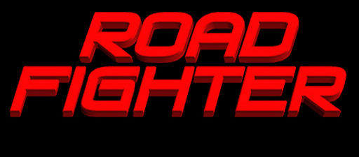
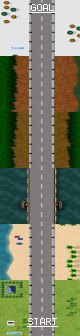
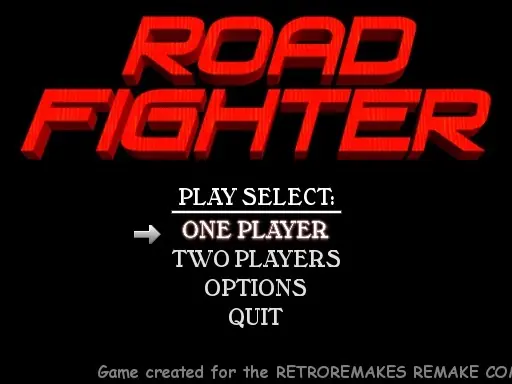
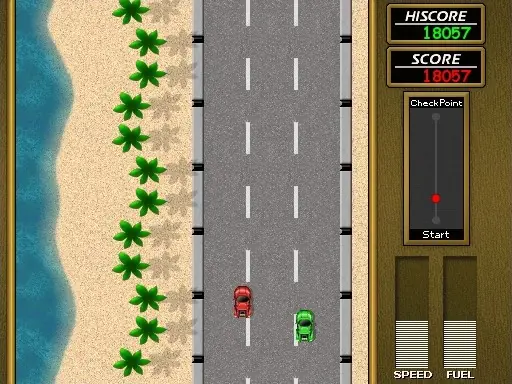
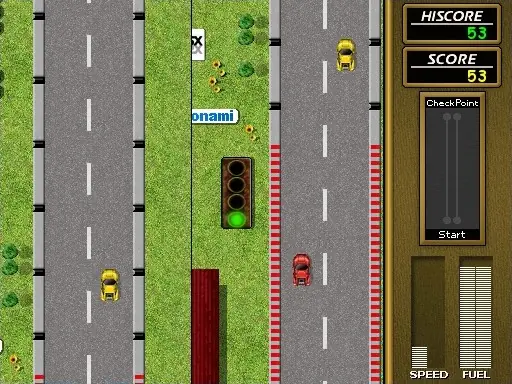
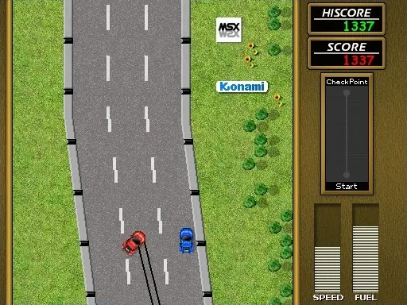

# Road Fighter Remake for Android TV


An unofficial Android TV / Google TV port of the open-source **Road Fighter Remake**, made for playing on a TV with a physical game controller.

The app runs completely offline and contains no ads, analytics, accounts, telemetry, or Internet permission.

## Download

**[Download the latest release](https://github.com/McHusky/RoadFighter-Remake-AndroidTV/releases/latest)**

Open the latest release and download the APK file, for example:

```text
RoadFighter-Remake-AndroidTV-v1.0.0.apk
```

The release also contains `SHA256SUMS.txt` if you want to verify the downloaded APK.

## Gallery

### Artwork & map

| Title artwork | Game map |
| :---: | :---: |
|  |  |

### Screenshots

| Main menu | Gameplay | Gameplay | Gameplay |
| :---: | :---: | :---: | :---: |
|  |  |  |  |

## Requirements

- Android TV or Google TV
- Android 9 (API 28) or newer
- ARM32 or ARM64 device
- A physical Android-compatible game controller is strongly recommended

The port has been tested on a **Google TV Streamer** with **8BitDo Micro** controllers in D-input mode.

Other controllers that Android exposes as a normal gamepad or joystick should work as well, but may not have been tested.

## Installation

1. Download the APK from the [Releases page](https://github.com/McHusky/RoadFighter-Remake-AndroidTV/releases/latest).
2. Transfer the APK to your Android TV / Google TV device using your preferred sideload method.
3. Open the APK on the TV.
4. If Android asks for permission to install apps from that source, allow it for the app you are using to open the APK.
5. Install **Road Fighter Remake** and launch it from the TV launcher.

For future releases, download the newer APK and install it over the existing release. Official releases from this repository use the same signing key so normal in-place updates are possible.

> If you previously installed an older development/debug build, Android may reject the first official release because the signatures differ. In that case, uninstall the old test build once and then install the release APK.

## Controller setup

Pair or connect your controller in the normal Android TV / Google TV settings before starting the game.

On the tested 8BitDo Micro, **D-input mode** works well.

The first controller that presses **B** is assigned to **Player 1**. A second controller can press **B** to become **Player 2**. A short message appears on screen when a player is connected.

The Google TV remote is intentionally **not** treated as a player controller.

## Controls

| Action | Controller |
| --- | --- |
| Navigate menus | D-pad / left stick **Up / Down** |
| Confirm / join game | **B** |
| Accelerate | **B** |
| Steer left / right | D-pad / left stick **Left / Right** |
| Back / cancel | **Y** |
| Pause | **Start** |

## Troubleshooting

### The controller does not respond

- Make sure the controller is paired with Android TV before launching the game.
- Press **B** once after starting the game so the controller is assigned to a player.
- With an 8BitDo Micro, try **D-input mode**.
- Disconnect and reconnect the controller if Android has stopped reporting it correctly.

### I cannot use the Google TV remote to play

That is intentional. The port keeps the TV remote separate from player input so normal launcher/system navigation is not accidentally interpreted as steering or acceleration. Use a game controller for gameplay.

## Tested hardware

Current release testing has primarily been done with:

- Google TV Streamer
- 8BitDo Micro controllers
- HDMI audio with the Google TV audio setting on **Automatic**

Reports from other Android TV / Google TV devices and controllers are welcome.

## Privacy

The app is fully offline. It does not request Internet access and contains no:

- analytics
- telemetry
- advertising
- user accounts
- cloud services
- tracking

## Thanks to the Road Fighter Remake team

A huge thank-you to the people who created the original **Road Fighter Remake** and made this Android TV port possible in the first place.

Special thanks to **Santi Ontañón** (programming), **Miikka Poikela** (graphics), **Jorrith Schaap** (music and sound effects), **Jason Eames** (beta testing), and to **Carlos Donizete Froes** for continuing and maintaining the SDL2-based source.

Please visit the upstream project here:

**[Road Fighter Remake on GitLab](https://gitlab.com/coringao/roadfighter)**

This Android TV version would not exist without their work.

## About this port

This repository contains an Android TV adaptation of the open-source **Road Fighter Remake**. The Android layer adds TV-friendly fullscreen presentation, controller handling, modern Android audio output, ARM32/ARM64 support, and compatibility fixes needed to run the original game code on current Android TV devices.

For build details and exact third-party versions, see:

- [`SOURCE.md`](SOURCE.md)
- [`THIRD_PARTY.md`](THIRD_PARTY.md)
- [`CHANGELOG.md`](CHANGELOG.md)

## License and trademarks

The Android TV adaptation follows the upstream Road Fighter Remake **GPL-2.0-or-later** licensing model. SDL components retain their upstream zlib licenses. See [`LICENSE`](LICENSE), [`LEGAL.md`](LEGAL.md), and [`THIRD_PARTY.md`](THIRD_PARTY.md) for details.

Road Fighter and related Konami names and assets remain the property of their respective rights holders. This is an unofficial open-source port and is not affiliated with or endorsed by Konami.
